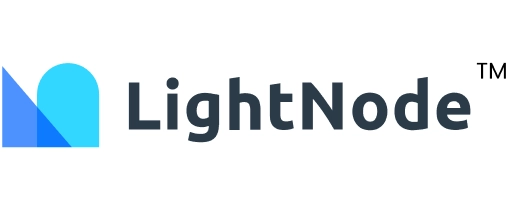

# Top 5 UK VPS Providers Worth Trying in 2025

---

Running a business that targets European customers? You'll need a server that doesn't slow you down. **UK VPS servers** sit right in the middle of Europe's digital highway—excellent infrastructure, low latency, and direct access to one of the world's busiest financial hubs.

Whether you're managing an e-commerce store, streaming content across Europe, or building apps for a global audience, a UK-based VPS gives you the speed and reliability your users expect. We've tested the market and narrowed it down to five providers that deliver real performance without the premium price tag.

---

## 1. LisaHost

LisaHost launched in 2017 from Hong Kong and quickly built a reputation for delivering native residential IPs across Asia and Europe. Their UK data center runs on BGP international networking, which means you get dual-ISP residential IPs by default—perfect for applications that need clean, unblocked connections.

**What makes LisaHost stand out:**
- Native UK residential IPs (great for TikTok operations and streaming)
- High-bandwidth plans without throttling
- Supports Alipay for easy payments
- Locations across Hong Kong, Taiwan, Japan, Singapore, US, and UK

The residential IP setup is particularly useful if you're running social media campaigns or need to access region-locked content. Their network stability has been consistently solid in our tests.

## 2. YingGuang Cloud (萤光云)

YingGuang Cloud operates 40+ nodes across 34 countries, making them one of the most geographically diverse providers on this list. Their UK node integrates well with their CN2-optimized routes for Asia-to-Europe traffic.

**Coverage includes:**
Hong Kong CN2, US CN2, Germany CN2, mainland China, Taiwan, Malaysia, Thailand, Vietnam, Japan, South Korea, Philippines, Singapore, Nepal, Bangladesh, Pakistan, Cambodia, Indonesia, Myanmar, Iraq, UAE, Saudi Arabia, Bahrain, Oman, Kuwait, Qatar, UK, Russia, France, Greece, Bulgaria, Turkey, Mexico, Brazil, Argentina, Chile, Colombia, Egypt, and South Africa.

If your project requires multi-region deployment with consistent management, YingGuang Cloud's unified control panel makes it simple to spin up instances wherever you need them.

Looking for reliable infrastructure that scales globally? 👉 [Vultr offers UK data centers with instant deployment and transparent pricing—no surprises, just performance](https://www.vultr.com/?ref=9738262-9J). Their London location connects seamlessly to the rest of Europe while maintaining excellent routes to North America and Asia.

## 3. LightNode

LightNode has been around since 2002 and operates 25 data centers worldwide. Their pricing model is straightforward: hourly billing with no minimum commitment. Load $10 and deploy unlimited instances across their network.

**Key features:**
- Starting at $7.71/month
- Pay-as-you-go hourly billing
- First deposit bonus: random $5-$20 credit
- Accepts PayPal, Alipay, and credit cards
- Locations include Istanbul, Hanoi, Ho Chi Minh City, Silicon Valley, Washington, Bangkok, Phnom Penh, Hong Kong, Taipei, Seoul, Johannesburg, Dhaka, Manila, Singapore, Dubai, Riyadh, Jeddah, Frankfurt, Kuala Lumpur, Tokyo, São Paulo, Cairo, Sofia, Bahrain, and Athens

The hourly billing is genuinely useful for development and testing. You're not locked into a monthly cycle if you only need resources for a few days.

## 4. Contabo

Contabo has been operating out of Munich, Germany since 2003. They've expanded from a single German data center to locations across the UK, US (Central, East, West), and Singapore. German engineering meets competitive pricing.

**What you get with Contabo:**
- VPS plans from 4-core to 10-core processors
- Starting at just $5.50/month
- Generous resource allocations (they don't skimp on RAM or storage)
- 20+ years of operational stability
- UK data center with excellent European connectivity

Contabo's reputation for reliability matches the German stereotype for precision and quality. Their configurations offer substantial resources at prices that undercut most competitors. If you need raw computing power without the premium markup, Contabo delivers.

## 5. Vultr

Vultr launched in 2014 and pioneered hourly billing for cloud servers. They now operate 30+ locations worldwide, including multiple UK data centers. Their KVM-based infrastructure provides consistent performance across all regions.

**Vultr highlights:**
- Plans starting at $2.50/month
- Hourly billing—pay only for what you use
- New user promotions: up to $300 in credits
- Alternative: deposit bonuses up to $100 match on $100 deposit
- Payment via Alipay, PayPal, or credit card
- Global presence across Japan, Singapore, US, Australia, Germany, France, and more

The new user credits give you substantial runway to test their infrastructure before committing real budget. Their control panel is intuitive, and spinning up new instances takes less than a minute.

Need a provider that combines global reach with predictable costs? 👉 [Vultr's UK servers offer the same high-performance infrastructure that powers applications worldwide, backed by transparent pricing and no hidden fees](https://www.vultr.com/?ref=9738262-9J).

---

## Choosing Your UK VPS Provider

Each of these providers excels in different areas. LisaHost wins on residential IP quality. YingGuang Cloud offers unmatched geographic coverage. LightNode's hourly billing provides maximum flexibility. Contabo delivers exceptional value on raw resources. And Vultr combines ease of use with reliable global infrastructure.

Your choice depends on your specific requirements: are you prioritizing network quality, geographic diversity, billing flexibility, resource allocation, or ease of deployment? All five handle the basics well—stable uptime, reasonable bandwidth, and responsive support. The differentiators come down to your use case.

For businesses targeting European markets, UK VPS hosting provides the network positioning you need to compete effectively. The infrastructure is mature, the connectivity is excellent, and these five providers make it accessible at prices that won't strain your budget.
